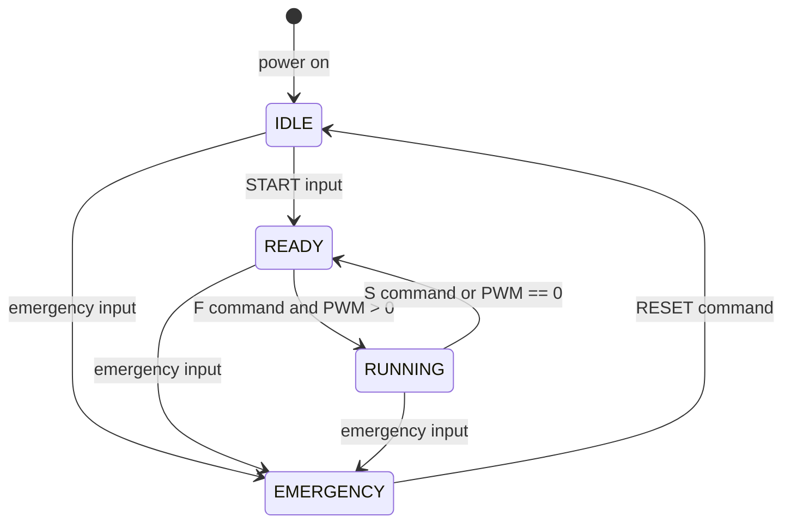

# TEAM-SILICA

Bare-metal DC motor-control ECU on an STM32F411CEU6 (Black Pill), built for the Silicon Sprint Hackathon (Embedded Systems).

## Demo Video

Project explanation and hardware demonstration: **[Watch the video (Google Drive)] https://drive.google.com/drive/folders/1nNRcAXU1QHfXBOM6gf9eYq1vzA1Yl1Zy?usp=sharing**

## Overview

The goal is a reliable DC motor controller with **explicit operating states**, **potentiometer speed control**, **safety handling**, and **diagnostic communication**.

The firmware is written in C on top of the STM32CubeIDE-generated HAL initialization. It uses no RTOS, no Arduino framework and no motor-control libraries. The application is organized around an explicit finite state machine (FSM) with four states (IDLE, READY, RUNNING, EMERGENCY), each shown on its own LED. A potentiometer sets the requested speed, a timer generates the PWM, and a TB6612FNG H-bridge drives the motor. An active-low emergency input is handled in an interrupt and always takes priority.

## Key Features

- Explicit 4-state FSM: `IDLE`, `READY`, `RUNNING`, `EMERGENCY`
- 12-bit ADC potentiometer input, linearly mapped to 0–100 % PWM duty
- Timer PWM (TIM3_CH1) feeding the TB6612FNG PWMA input; forward direction only
- Motor starts only when the FSM allows it. The potentiometer alone never starts the motor
- Interrupt-driven emergency stop (EXTI, falling edge) that forces PWM to 0, drives the driver outputs low, and locks the motor
- One LED per state, updated from a single function
- START input with 30 ms debounce
- UART command and diagnostic interface (`F`, `S`, `STATUS`, `RESET`) implemented in firmware (see [UART Diagnostics](#uart-diagnostics) for verification status)
- Temporary PA15 diagnostic input for hardware validation (see [Diagnostics](#diagnostics))
- No dynamic memory allocation, no DMA, no blocking delays in the control loop

## System Architecture

```
Potentiometer
     ↓
STM32F411 ADC (A0, ADC1_IN0, 12-bit)
     ↓
Application FSM (app.c)
     ↓
PWM generation (TIM3_CH1 on A6)
     ↓
TB6612FNG (PWMA, AIN1, AIN2, STBY)
     ↓
DC Motor
```

**Emergency path (bypasses normal control flow):**

```
Emergency input (B6, EXTI falling edge)
     ↓
EXTI interrupt callback
     ↓
Motor_EmergencyKill(): PWM = 0, AIN1/AIN2/STBY low, motor locked
     ↓
FSM state = EMERGENCY  →  EMERGENCY LED (main loop)
```

## State Machine



| State | Meaning | Motor | LED |
|---|---|---|---|
| `IDLE` | Power-on state. System not enabled. `F` is rejected | OFF | B8 |
| `READY` | System enabled by START. Waiting for a run command | OFF | B9 |
| `RUNNING` | Motor driven forward at the potentiometer-commanded duty | ON | B10 |
| `EMERGENCY` | Latched safe state. Only `RESET` leaves it | OFF (locked) | B12 |

After `RESET`, the FSM returns to `IDLE`, not `READY`. START must be activated again.

## Hardware

- STM32F411CEU6 Black Pill (MCU)
- TB6612FNG dual motor driver (one channel used, channel A)
- DC motor
- Potentiometer (speed command)
- 4 LEDs (2 blue, 2 white) as state indicators
- START input (active-low, internal pull-up)
- Emergency stop input (active-low, internal pull-up)
- PA15 diagnostic input (temporary, active-low, internal pull-up)
- ST-Link programmer
- Motor power supply (see note under [Pin Connections](#pin-connections))

## Pin Connections

MCU pin names are the STM32CubeMX names. All MCU-side assignments below come from `ecu_config.h` unless noted.

### STM32 pins

| STM32 pin | Function | Connected hardware | Notes |
|---|---|---|---|
| A0 | ADC1_IN0 | Potentiometer wiper | 12-bit, 0–4095 |
| A6 | TIM3_CH1 (PWM) | TB6612FNG **PWMA** | Motor speed |
| A7 | GPIO output | TB6612FNG **AIN1** | HIGH in forward |
| B0 | GPIO output | TB6612FNG **AIN2** | LOW in forward |
| B1 | GPIO output | TB6612FNG **STBY** | HIGH enables driver |
| B5 | GPIO input, pull-up | START input | Active-low, 30 ms debounce |
| B6 | EXTI6, pull-up, falling edge | Emergency stop input | Active-low |
| A15 | GPIO input, pull-up | Diagnostic input | **Temporary**, active-low |
| B8 | GPIO output | IDLE LED | Active-high |
| B9 | GPIO output | READY LED | Active-high |
| B10 | GPIO output | RUNNING LED | Active-high |
| B12 | GPIO output | EMERGENCY LED | Active-high |
| A9 / A10 | USART1 TX / RX | UART host (not verified) | 115200 8N1 is the design target, set in CubeMX. See [UART Diagnostics](#uart-diagnostics) |

### TB6612FNG signals

The table below lists which TB6612FNG pins the MCU drives. Only these signals are defined in the source.

| TB6612FNG pin | Driven by |
|---|---|
| PWMA | MCU A6 |
| AIN1 | MCU A7 |
| AIN2 | MCU B0 |
| STBY | MCU B1 |

### Not defined in the source (needs confirmation)

These connections are not in the firmware and are intentionally not specified here:

- Potentiometer end terminals (supply and ground reference)
- TB6612FNG motor outputs (AO1/AO2) to the motor terminals
- TB6612FNG VM (motor supply) voltage and source, and VCC (logic supply)
- Common ground between the Black Pill, TB6612FNG and motor supply
- LED series resistor values and which LED color is used for which state
- Which physical device or wiring is used for the START, emergency and PA15 inputs

## Firmware Architecture

CubeMX/HAL generates the peripheral initialization (ADC1, TIM3, USART1, GPIO, EXTI). The five custom files below hold all application logic.

| File | Purpose |
|---|---|
| `ecu_config.h` | Pin assignments, peripheral handle aliases and timing/scaling constants in one place |
| `motor.h` | Public interface of the motor driver layer |
| `motor.c` | TB6612FNG hardware layer: PWM duty, direction, standby, stop, emergency kill and lock. Contains no FSM logic |
| `app.h` | `SystemState` enum and the `App_Init()` / `App_Run()` entry points |
| `app.c` | FSM, ADC processing, button debounce, UART command parser, LED update, EXTI and UART callbacks |

### Repository layout

**Custom application code (written by the team):**
`Core/Inc/ecu_config.h`, `Core/Inc/motor.h`, `Core/Inc/app.h`, `Core/Src/motor.c`, `Core/Src/app.c`

**Generated by STM32CubeMX / STM32CubeIDE (peripheral setup and HAL infrastructure):**

- `silicon-sprint-hackathon.ioc`: the CubeMX project (pins, clocks, peripherals)
- `Core/Src/main.c`, `stm32f4xx_it.c`, `stm32f4xx_hal_msp.c`, `system_stm32f4xx.c`, `syscalls.c`, `sysmem.c` and the matching headers in `Core/Inc/`. Only the `App_Init()` / `App_Run()` calls were added to `main.c`
- `Core/Startup/` and the `STM32F411CEUX_*.ld` linker scripts
- `Drivers/`: CMSIS and the STM32F4xx HAL driver
- `USB_DEVICE/` and `Middlewares/ST/STM32_USB_Device_Library/`: USB CDC code generated during the USB investigation. The application code does not use it, and USB CDC was not part of the demonstration

**Build output (not source):** `Debug/` contains compiler output and should not be committed.

Integration in `main.c`:

```c
/* after the MX_..._Init() calls */
App_Init();

while (1)
{
    App_Run();
}
```

## Control Flow

1. **Boot:** `Motor_Init()` forces all driver outputs safe and starts the PWM at 0 %. State is `IDLE` and the IDLE LED is on. If the emergency input is already held at power-up, the firmware starts in `EMERGENCY`.
2. **Main loop (`App_Run`):** each pass samples the potentiometer (every 10 ms), checks the START input, processes UART input, runs the diagnostic check, runs `FSM_Update()` and refreshes the LEDs.
3. **START:** a debounced press in `IDLE` moves to `READY`. The motor stays off.
4. **Run:** `F` in `READY`, with PWM > 0 and no emergency, calls `StartMotor()`, which sets forward direction, enables STBY, applies the PWM and enters `RUNNING`. In `RUNNING` the PWM follows the potentiometer.
5. **Stop:** `S` stops the motor and returns `RUNNING` to `READY`. If the commanded PWM falls to 0 while running, the FSM also returns to `READY`.
6. **Emergency:** the EXTI interrupt shuts the motor down and latches `EMERGENCY` from any state. `RESET` returns to `IDLE`.

## PWM and Motor Control

**ADC to PWM mapping (from `app.c`):**

- 12-bit ADC, 0–4095
- Each sample is the average of 4 conversions, taken every 10 ms
- Linear mapping: `PWM % = raw × 100 / 4095` (integer math). For example, 1024 gives 25 %, 2048 gives 50 %, and 4095 gives 100 %
- The potentiometer only updates the *commanded* value. The FSM decides whether it is applied

**PWM output:**

- TIM3 channel 1 on A6 feeds the TB6612FNG PWMA input
- The compare value is computed from the timer's actual auto-reload value as `(ARR + 1) × percent / 100`, so the duty mapping works with whatever period is configured in CubeMX
- The PWM frequency is a CubeMX timer setting and is not defined in the application source. The design target was approximately 20 kHz. Confirm the actual value against the `.ioc` file before quoting it

**TB6612FNG control:**

| Condition | AIN1 (A7) | AIN2 (B0) | STBY (B1) | PWM (A6) |
|---|---|---|---|---|
| Forward / running | HIGH | LOW | HIGH | commanded duty |
| Stopped | LOW | LOW | LOW | 0 % |

Reverse is not implemented.

## Safety

- The emergency input (B6) is an EXTI falling-edge interrupt, so it preempts normal code. The ISR calls `Motor_EmergencyKill()`, which sets a lock flag and writes PWM = 0 and AIN1, AIN2 and STBY low. The ISR then latches `EMERGENCY` and sets a flag so the main loop can report it.
- While locked, `Motor_SetPWM`, `Motor_Forward` and `Motor_Enable` refuse to act. A start sequence that was in progress when the interrupt fired cannot re-enable the motor.
- Check-and-set operations in the main loop (state transitions and `StartMotor()`) run with interrupts briefly disabled, so an emergency cannot be overwritten by a concurrent transition.
- The lock is released only by `RESET` while in `EMERGENCY`. `RESET` is refused while the emergency input is still asserted, leaves the motor off, and returns to `IDLE`.
- The motor is forced off in `IDLE`, `READY` and `EMERGENCY` on every loop pass.
- The potentiometer, boot and `RESET` never start the motor by themselves.

## Diagnostics

**PA15 is a temporary diagnostic input used for hardware validation. It is not the intended final user interface.**

During the hardware demonstration, the normal command interface could not be exercised from a laptop because no USB-to-TTL converter was available. PA15 was added so the motor path could still be validated.

- PA15: GPIO input with internal pull-up. HIGH means normal behaviour, LOW means diagnostic active
- When PA15 is pulled LOW, `Diag_ForceRunning()` reuses the existing mechanisms. It performs the same `IDLE → READY` transition as START, then calls the same `StartMotor()` used by the UART `F` command
- No new state, no direct motor or PWM writes, and the existing safety checks still apply: PWM must be > 0, and nothing happens in `EMERGENCY`
- Releasing PA15 does not stop the motor. Use `S`, the emergency input, or turn the potentiometer to 0
- The diagnostic is a single call in `App_Run()` and one function in `app.c`, and should be removed for a production build

## UART Diagnostics

The firmware contains an interrupt-driven UART command and status interface on USART1 (A9 TX, A10 RX), with 115200 8N1 as the design target configured in CubeMX.

- Commands: `F`, `S`, `STATUS`, `RESET`. Input is case-insensitive and CR/LF terminated, or terminated after 50 ms of silence
- State transitions and the emergency event are reported as text messages
- `STATUS` reports FSM state, system enabled/disabled, motor ON/OFF, PWM %, raw ADC value and emergency status

**Verification status:** the UART configuration and code exist in the firmware, but **physical UART communication with a laptop was not verified**, because a USB-to-TTL converter was not available. The behaviour described above comes from the source code, not from observed serial output. USB CDC was investigated during development but is not part of the demonstrated or documented interface.

## Build and Flash

1. Open the project in STM32CubeIDE.
2. Generate CubeMX code if required (CubeMX owns the peripheral initialization: ADC1, TIM3, USART1, GPIO, EXTI).
3. Make sure the application files are in the project: `ecu_config.h`, `motor.h`, `app.h` in `Core/Inc/`, and `motor.c`, `app.c` in `Core/Src/`. Make sure `main.c` calls `App_Init()` after peripheral initialization and `App_Run()` in the main loop.
4. Build the project.
5. Connect the ST-Link and flash the board.
6. Power the hardware and run.

## Hardware Testing

Tests performed on the physical prototype:

- Firmware build
- Deployment to the STM32F411 Black Pill
- LED state indication
- PA15 diagnostic activation of the motor path
- Potentiometer-based speed control
- Motor operation through the TB6612FNG
- Emergency shutdown

Not performed: UART communication with a laptop. No measurements (PWM frequency, current, response time) were recorded, so none are claimed.

## Limitations and Future Improvements

Not implemented in the current version:

- Physical UART verification with a USB-to-TTL adapter
- Proper external button integration in place of the PA15 diagnostic
- ADC filtering beyond the 4-sample average
- PWM ramping (the duty follows the potentiometer directly)
- Watchdog
- DMA-based ADC and UART
- Reverse direction
- More extensive fault detection (for example, motor current sensing)

## Team

TEAM-SILICA
